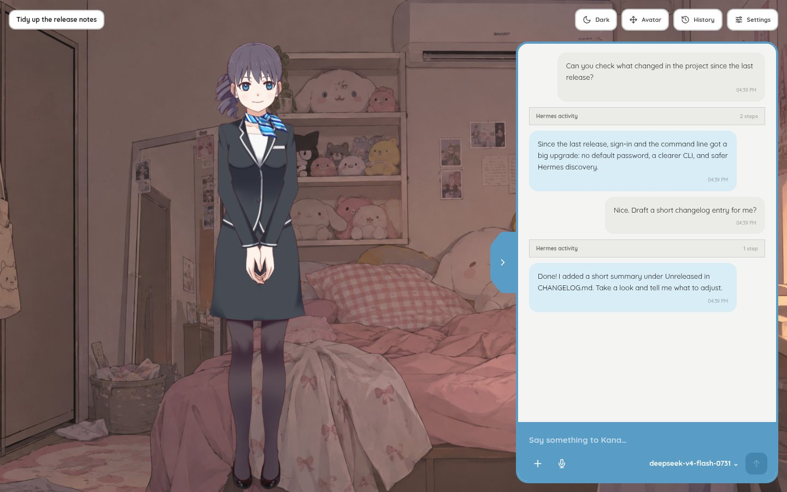
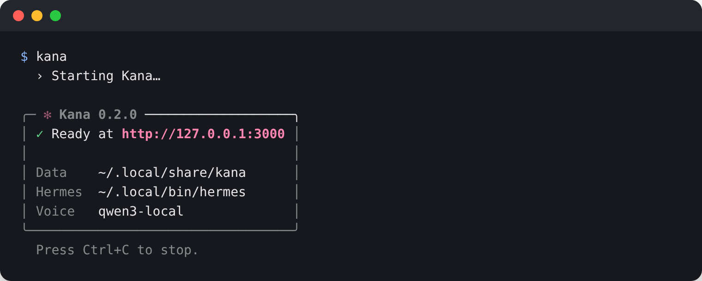
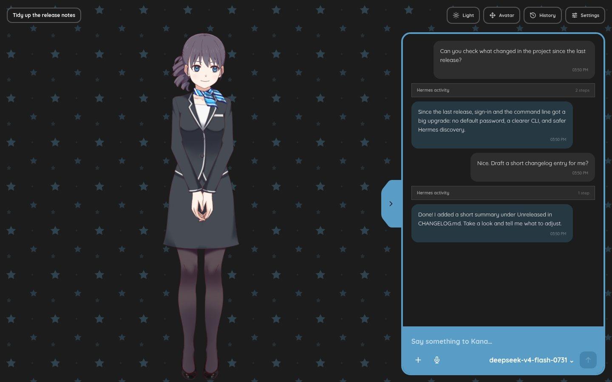
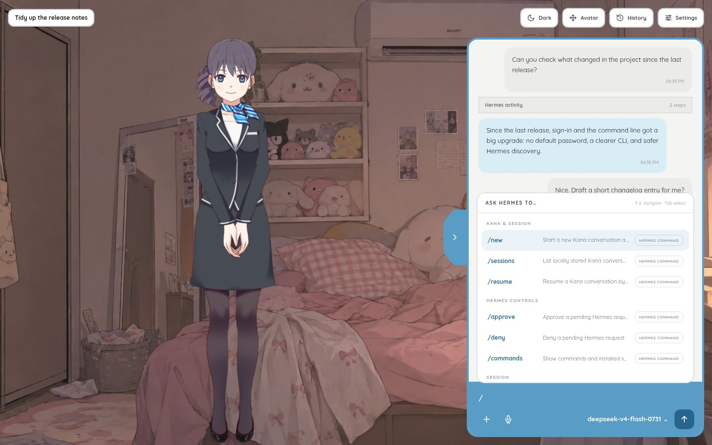
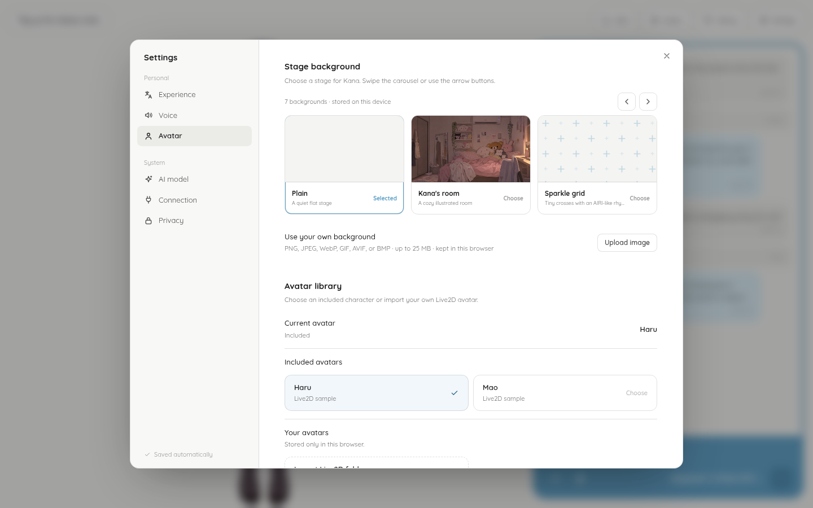
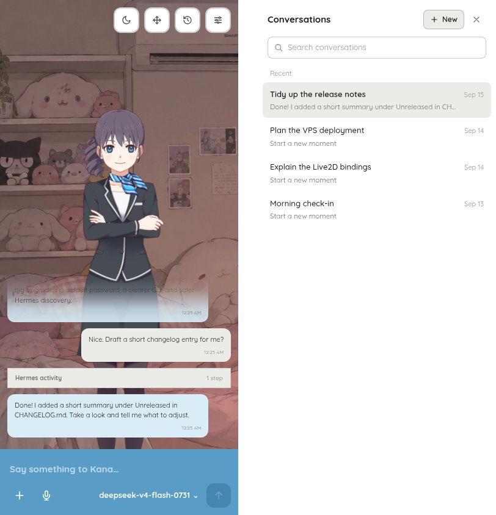

<div align="center">

# Kana

**A living, talking face for your [Hermes Agent](https://github.com/NousResearch/hermes-agent).**

Kana puts a Live2D character, Japanese voice, and subtitles in the language you write in on top of the Hermes you already run.
Hermes stays the only agent: its tools, files, memory, and sessions work exactly as before.

[](https://www.npmjs.com/package/kana-alya)
[](LICENSE)




</div>

## Contents

- [Why Kana](#why-kana)
- [Quick start](#quick-start)
- [Screenshots](#screenshots)
- [Features](#features)
- [Deploy on a VPS](#deploy-on-a-vps)
- [Connecting to Hermes](#connecting-to-hermes)
- [Voice](#voice)
- [Live2D avatars](#live2d-avatars)
- [How it works](#how-it-works)
- [Development](#development)
- [Documentation](#documentation)

## Why Kana

Hermes is powerful, but a terminal or chat log is not much company. Kana is a
presentation layer, not another assistant:

- **One agent.** Every reply comes from your Hermes session. Kana never runs a
  second model, translator, or tool loop.
- **Your installation, untouched.** Kana starts or adopts the official
  `hermes serve` and never patches or writes into Hermes.
- **Private by design.** The Hermes session token stays inside the Kana server.
  Your browser talks only to Kana, behind your own password.

## Quick start

You need **Linux x64 (glibc)**, **Node.js 22.13+**, and
[Hermes Agent](https://github.com/NousResearch/hermes-agent) installed.

```bash
npm install -g kana-alya
kana
```

The first run asks you to create an access password, then opens Kana in your
browser. There is no default password.

<p align="center">
  
</p>

Useful commands:

| Command | What it does |
|---|---|
| `kana` | Start Kana on this computer and open the browser |
| `kana serve` | Run headless for a VPS or systemd service |
| `kana password` | Create or change the access password (`--stdin` for scripts) |
| `kana doctor` | Check Node.js, Hermes, password, voice, and data folders |
| `kana setup` | Prepare optional local voice cloning (Qwen3-TTS) |
| `kana config` | Open the advanced `config.json` |

Your data (password hash, settings, voice profiles, model cache) lives in
`$KANA_DATA_DIR` when set, otherwise `$XDG_DATA_HOME/kana` or
`~/.local/share/kana`.

## Screenshots

<table>
  <tr>
    <td width="50%"></td>
    <td width="50%"></td>
  </tr>
  <tr>
    <td align="center"><sub>Dark theme and built-in stage backgrounds</sub></td>
    <td align="center"><sub>Hermes slash commands, read live from your installation</sub></td>
  </tr>
  <tr>
    <td width="50%"></td>
    <td width="50%"></td>
  </tr>
  <tr>
    <td align="center"><sub>Avatars, stages, and per-model bindings</sub></td>
    <td align="center"><sub>Works on phones too</sub></td>
  </tr>
</table>

## Features

**Conversation**
- Japanese speech with subtitles in the language you write in — no setting to
  pick. Switching language affects new replies only; old subtitles stay exactly
  as you saw them.
- History comes from Hermes, so conversations follow you to other browsers.
- The Hermes activity log shows which tools ran for each reply.
- Composer with [file attachments, voice dictation, and a model picker](docs/COMPOSER.md).

**Hermes controls**
- The live, categorized `/` command catalog with argument completion, including
  your installed skills.
- Dedicated dialogs for approvals and clarifications. Sudo passwords and secrets
  are never stored.
- `/new`, `/sessions`, `/resume`, `/branch`, `/title`, `/status`, `/compress`, and more.

**Character**
- Live2D avatars: the official Haru and Mao samples, any hosted `.model3.json`,
  or a model folder imported into your browser.
- Emotions, motions, lip sync, and cursor-following gaze.
- Stage backgrounds, including your own images, plus light and dark themes.

**Voice**
- Local Qwen3-TTS with voice cloning from a short, consented sample.
- Or any OpenAI-compatible speech API, with a Pollinations preset.
- Lip sync follows the audio, and Stop cancels generation on the server.

**Security and operations**
- Password sign-in with lockout that never blocks your own known browsers and
  does not depend on IP addresses (safe behind shared home internet).
- Cross-site request protection, server-side logout, and an owner-only data folder.
- Installable app shell, credential-free backup and restore, and safe diagnostics.

## Deploy on a VPS

`kana serve` runs the same app headless. Set the password once as the account
that owns Hermes, then run Kana behind HTTPS:

```bash
KANA_DATA_DIR=/var/lib/kana kana password
KANA_DATA_DIR=/var/lib/kana kana serve --port 3000
```

- Run it with systemd **as the same user that runs Hermes**. Linux only lets that
  user read the Hermes session token.
- Put Nginx in front for HTTPS. Use `proxy_set_header Host $http_host;`, disable
  buffering for `/api/hermes/events`, and allow `client_max_body_size 14m`.

The complete systemd unit and Nginx configuration are in the
[VPS deploy checklist](docs/SUPPORTED_ENVIRONMENT.md#vps-deploy-checklist).
To build from source instead of npm, see [Install and deploy Kana](docs/INSTALLATION.md).

> [!WARNING]
> `npm run dev` is a development server only. Never keep it running behind
> Nginx or on a VPS.

## Connecting to Hermes

Usually there is nothing to do. Kana:

1. finds the Hermes executable in `PATH` or the usual install locations (the
   official installer, pipx, uv, Nix, Homebrew, and Termux);
2. adopts a running `hermes serve` owned by the same user, or starts one on
   `127.0.0.1` with a token that only the Kana server knows;
3. connects your browser through Kana's authenticated relay.

If detection fails, `kana doctor` shows what it found. Set
`hermes.executable` in `config.json` to an absolute path and restart Kana.
Details: [Hermes auto-detection on Linux](docs/SUPPORTED_ENVIRONMENT.md#hermes-auto-detection-on-linux).

To start Hermes yourself, give it a token Kana can discover:

```bash
HERMES_DASHBOARD_SESSION_TOKEN="a-long-random-token" hermes serve --host 127.0.0.1 --port 9119
```

## Voice

Voice is optional. Turn Kana's voice on or off in **Settings → Voice**; replies
always stay readable as text.

- **Local Qwen3-TTS (default).** Run `kana setup` to prepare an isolated Python
  environment (about 4 GB with the model). The official
  `Qwen/Qwen3-TTS-12Hz-0.6B-Base` model downloads on first use and runs on CPU.
  Clone a voice from a consented sample of up to 10 MB.
- **OpenAI-compatible API.** Point `tts.provider` at any `POST /v1/audio/speech`
  service. API keys stay in the server's `config.json` and never reach the browser.

Configuration examples are in [TTS providers](docs/CONFIGURATION.md#tts-providers),
and the local service is described in [services/qwen3-tts](services/qwen3-tts/README.md).
CPU synthesis is slower than realtime on modest hardware.

## Live2D avatars

Choose **Haru** or **Mao** in **Settings → Avatar**, paste a hosted
`.model3.json` URL, or import a model folder. Imported folders stay in your
browser (IndexedDB) and are never uploaded. Each model has its own bindings for
the mouth parameter, emotion expressions, and motion groups, which you can
preview before saving.

The official samples load from Live2D's pinned sample repository and are not
redistributed by Kana.

> This content uses sample data owned and copyrighted by Live2D Inc. The sample
> data are utilized in accordance with terms and conditions set by Live2D Inc.
> This content itself is created at the author's sole discretion. See the
> [official sample model terms](https://www.live2d.com/en/learn/sample/model-terms/).

## How it works

```text
Browser (Kana UI)
  │  session cookie, same origin only
  ▼
Kana server (Next.js)
  ├─ /api/hermes/*    → one server-held WebSocket → hermes serve  → Hermes agent
  ├─ /api/voice/tts/* → local Qwen3-TTS service or OpenAI-compatible API
  └─ data folder      → password hash, settings, activity log, voices
```

Hermes events are translated into a stable internal model that drives the
transcript, activity log, avatar emotion, and audio. Each reply carries Japanese
speech, a subtitle, and an emotion in one structured Hermes response. More in
[process boundaries](docs/ADR-001-PROCESS-BOUNDARIES.md) and the
[security model](docs/SECURITY.md).

## Development

```bash
git clone https://github.com/misaalya/kana-hermes.git
cd kana-hermes
npm ci
npm run password                         # once, for your local data folder
npm run dev -- --hostname 127.0.0.1      # http://127.0.0.1:3000
```

Build and run the production package from the checkout:

```bash
npm run package:local
node bin/kana.mjs
```

Checks:

```bash
npm run lint && npx tsc --noEmit && npm test   # fast
npm run quality                                # full gate, including browser journeys
```

Real-environment checks (need Hermes, network, or target hardware) are
`npm run test:hermes:restart`, `npm run test:live2d:official`,
`npm run tts:acceptance`, and `npm run test:package:npm`.
Contributor rules are in [AGENTS.md](AGENTS.md).

## Documentation

| Topic | Guide |
|---|---|
| Installing locally or on a server | [INSTALLATION.md](docs/INSTALLATION.md) |
| `config.json`, TTS providers, deployment mode | [CONFIGURATION.md](docs/CONFIGURATION.md) |
| VPS, systemd, Nginx, supported platforms | [SUPPORTED_ENVIRONMENT.md](docs/SUPPORTED_ENVIRONMENT.md) |
| Threat model and reverse proxy | [SECURITY.md](docs/SECURITY.md) |
| Attachments, dictation, model picker | [COMPOSER.md](docs/COMPOSER.md) |
| Qwen3-TTS on a VPS | [QWEN3_TTS_VPS_ACCEPTANCE.md](docs/QWEN3_TTS_VPS_ACCEPTANCE.md) |
| Quality gates and releases | [QUALITY.md](docs/QUALITY.md) · [RELEASE_CHECKLIST.md](docs/RELEASE_CHECKLIST.md) |
| Changes and migration notes | [CHANGELOG.md](CHANGELOG.md) |
| Roadmap | [PLAN.md](PLAN.md) |

## License

[MIT](LICENSE). Live2D sample models are subject to Live2D's own terms, above.
